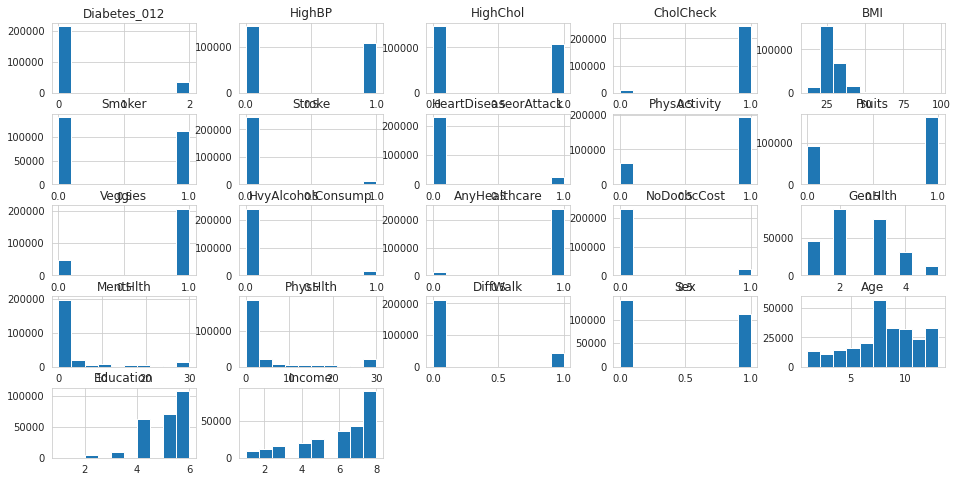
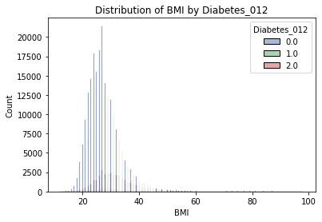
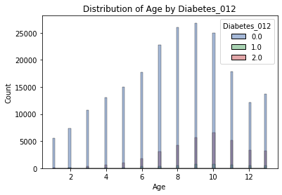
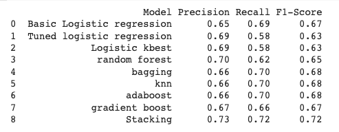
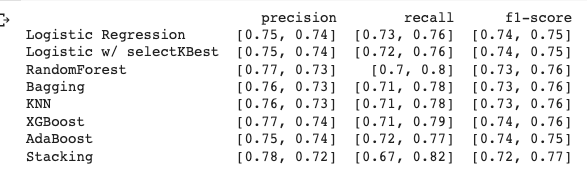
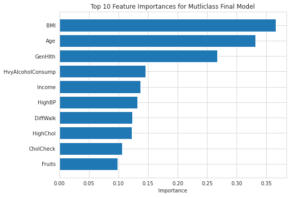

# Diabetes-Classifier-Project
Diabetes-Classifier-Project for Flatiron School

**Diabetes Phone Screening Classification Model**

## Business and Data Understanding:

Stakeholders: 
- Mt. Sinai's telemedicine targets pre-diabetics through preventive monitoring.
- Regular check-ins with healthcare providers, including self-management classes, nutrition counseling, and prevention programs, can help reduce readmissions.
- Early diabetes monitoring can allow for quick action. Regular preventative monitoring can reduce diabetes risk. Closely tracking and analyzing indicators helps prompt necessary preventative measures.

Business objectives:
- Mt. Sinai has a limited staff and equipment to serve those at-risk.
- Targeted preventative measures should be implemented for those individuals who are most likely to become afflicted with the disease.
- How can Mt. Sinai target at-risk patients? Develop a classification model to identify at-risk diabetics using known impactors such as BMI, age, diet and other data from phone screening.

## Data understanding:
- There are two Datasets used in this study: diabetes_012_health_indicators_BRFSS2015.csv and diabetes_binary_5050split_health_indicators_BRFSS2015.csv
- The Behavioral Risk Factor Surveillance System (BRFSS) is a health-related telephone survey that is collected annually by the CDC. These are a subset of features and rows of this total collection.
- diabetes_012_health_indicators_BRFSS2015.csv has 253,680 survey responses. The target variable Diabetes_012 has 3 classes. 0 is for no diabetes, 1 is for prediabetes, and 2 is for diabetes. This dataset has 21 features of binned categories into discrete variables. For example, 'HighBP' is already binned into binary variables where 0 = not high and BP 1 = high BP.
- Target variable: Diabetes_012 multiclass target where 0 = no diabetes, 1 = prediabetes and 2 = diabetes.
- diabetes_binary_5050split_health_indicators_BRFSS2015.csv has 70692 survey respondents undersampling the majority class from the original dataset by the original source of the data
- Target variable: Diabetes_binary is binary target where 0 = no diabetes, 1 = prediabetes or diabetes.

High negative correlations:
- Income
- Education
- PhysActivity
- 
Highest positive correlations:
- GenHlth
- HighBP
- DiffWalk
- BMI

Yes, there is a class imbalance. Class 0 has a significantly larger number of samples compared to classes 1 and 2. We will undersample the major and also utilize SMOTE later.

 

BMI is skewed to the for diabetic patients.

 

Age is also skewed to the for diabetic patients.

Due to the size of the dataset and time for processing, we are undersampling the majority class 0 and keeping all rows for the minority class. Randomly selecting the matching length of minority class from majority dataframe.

## Modeling

During this iteration process for the multiclass problem of predicting for 0 (non-diabetic), 1 (prediabetic) or 2 (diabetic), I processed the following models:
- Basic logistic regression will be our basline model. We will score for macro recall because of multiclass classification and wanting to account for positive instances of our target for our minority class '1'.
- Add a parameter grid search for logistic regression with SMOTE for minority and standard scaler to improve the model.
- Utilize KBest features for tuned logistic regression model.
- RandomForest classifier with randomsearch, standard scaler and SMOTE in pipeline.
- Utilize a bagging model with DecisionTree as my base estimator and grid search for optimal params.
- Utilize KNN model with SelectKBest features and grid search.
- Utilize AdaBoostClassifier with standard scaler and gridsearch
- Utilize GradientBoost classifier with SMOTE, standard scaler for numeric columns and gridsearch.
- Stacking model using xgb, bagging, randomforest and adaboost pipelines. Utilize parameters that were optimized during earlier models.

Then when I shifted to the binary class problem of predicting for 0 (non-diabetic) or 1 (prediabetic or diabetic), I processed the same iterations of models:
- Basic logistic regression will be our basline model. 
- Add a parameter grid search for logistic regression with SMOTE for minority and standard scaler to improve the model.
- Utilize KBest features for tuned logistic regression model.
- RandomForest classifier with randomsearch and standard scaler in pipeline.
- Utilize a bagging model with DecisionTree as my base estimator and grid search for optimal params.
- Utilize KNN model with SelectKBest features and grid search.
- Utilize AdaBoostClassifier with standard scaler and gridsearch
- Utilize GradientBoost classifier with standard scaler for numeric columns and gridsearch.
- Stacking model using xgb, bagging, randomforest and adaboost pipelines. Utilize parameters that were optimized during earlier models.

## Evaluation

Based on the classification reports, it appears that the basic logistic regression, bagging, and knn models all performed similarly with an accuracy score of around 70%. However, these models fail to predict for the minority class '1' at all while tuned logistic regression, logistic kbest, random forest, and gradient boost models all had lower accuracy scores but did successfully predict for value '1' of target.

Overall, it seems that these techniques were not very successful in the multiclass approach. Bagging and knn models may be the best choices for this particular dataset due to highest accuracy scores and precision and recall scores above 0.7 for all three classes, however, it's worth noting the next notebook for Binary approach improves on this multiclass approach.

I will select AdaBoost as our final model in proposal.

All of these models seem to have similar performance with an overall accuracy of around 75%. This is a strong improvement over the multiclass models from the first notebook. The precision and recall scores for the two classes (0 and 1) are also relatively similar across the models. However, there are slight variations in the macro and weighted F1 scores.

The logistic regression model with and without selectKBest feature selection has the lowest accuracy and F1 scores. This could indicate that the model is underfitting the data and may not be capturing the complexity of the relationships between the features and the target variable. The other models, including RandomForest, Bagging, KNN, XGBoost, AdaBoost, and Stacking models seem to be performing similarly well, with only slight variations in their precision, recall, and F1 scores.

 age_distribution.png

BMI, age and general health are the most important features of our model. 

## Conclusion and Recommendations

Takeaways:
- Predicting diabetes with phone screening is not very reliable
- Binary model performs better than multi-class and still applies to our business case
- Model can still be useful for a generalization of risk
- Further improve model by tuning hyper-parameters, try more models, polynomial feature engineering etc.
- Look in the future to add additional biometric data to strengthen predictions
- Prioritize feedback on BMI, age and general health on future surveys as these have the strongest
