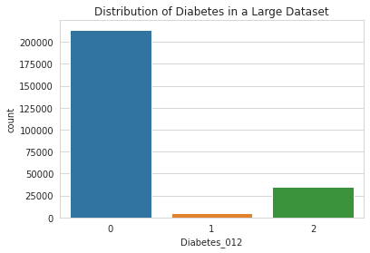

# Diabetes-Classifier-Project
Diabetes-Classifier-Project for Flatiron School

**Diabetes Phone Screening Classification Model**

## Business and Data Understanding:

Stakeholders: 
- Mt. Sinai's telemedicine targets pre-diabetics through preventive monitoring.
- Regular check-ins with healthcare providers, including self-management classes, nutrition counseling, and prevention programs, can help reduce readmissions.
- Early diabetes monitoring can allow for quick action. Regular preventative monitoring can reduce diabetes risk. Closely tracking and analyzing indicators helps prompt necessary preventative measures.

Business objectives:
- Mt. Sinai has a limited staff and equipment to serve those at-risk.
- Targeted preventative measures should be implemented for those individuals who are most likely to become afflicted with the disease.
- How can Mt. Sinai target at-risk patients? Develop a classification model to identify at-risk diabetics using known impactors such as BMI, age, diet and other data from phone screening.

## Data understanding:
- There are two Datasets used in this study: diabetes_012_health_indicators_BRFSS2015.csv and diabetes_binary_5050split_health_indicators_BRFSS2015.csv
- The Behavioral Risk Factor Surveillance System (BRFSS) is a health-related telephone survey that is collected annually by the CDC. These are a subset of features and rows of this total collection.
- diabetes_012_health_indicators_BRFSS2015.csv has 253,680 survey responses. The target variable Diabetes_012 has 3 classes. 0 is for no diabetes, 1 is for prediabetes, and 2 is for diabetes. This dataset has 21 features of binned categories into discrete variables. For example, 'HighBP' is already binned into binary variables where 0 = not high and BP 1 = high BP.
- Target variable: Diabetes_012 multiclass target where 0 = no diabetes, 1 = prediabetes and 2 = diabetes.
- diabetes_binary_5050split_health_indicators_BRFSS2015.csv has 70692 survey respondents undersampling the majority class from the original dataset by the original source of the data
- Target variable: Diabetes_binary is binary target where 0 = no diabetes, 1 = prediabetes or diabetes.

High negative correlations:
- Income
- Education
- PhysActivity
- 
Highest positive correlations:
- GenHlth
- HighBP
- DiffWalk
- BMI

Yes, there is a class imbalance. Class 0 has a significantly larger number of samples compared to classes 1 and 2. We will undersample the major and also utilize SMOTE later.

 

